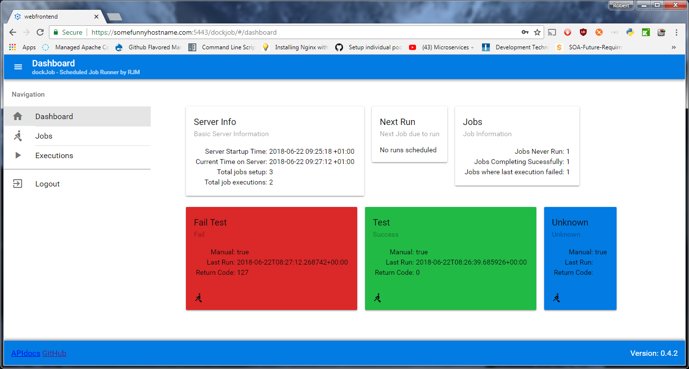

# DockJob

Job scheduler  with a web UI - designed to run inside a container. I am creating this project to build myself a small light weight job scheduler. I need this because I am building a docker stack and I want to run a scheduler  inside the stack to replace the use of cron. My searches for alternatives (https://github.com/jjethwa/rundeck/issues/101) have hit a deadend, so I thought I would put together a simple API based python application.

I put images for this project into the [Docker hub](https://hub.docker.com/r/metcarob/dockjob/)

# Features


[See more](./screenshots/README.md)

 - Runs commands based on a schedule
 - 'Run now' button as well as scheduled run
 - Web App UI developed which connects to api.
 - Works in any web context
 - Works from any port
 - Will run any command inside the container - but I am really focused to run wget commands. This makes use of security provided by docker networking.
 - Doesn't do https or security itself - [Kong](https://konghq.com/) will also be deployed to the stack to provide this
 - Main interface is a simple json api
 - Keeps logs of recent runs of jobs.
 - INITIALLY won't use a data store as a backend. On restart will lose all data, configured jobs, logs, etc.


# Getting started - Running DockJob to check it out...

On a machine with docker installed run the following command:
````
docker run -d -p 80:80 -e APIAPP_APIURL='http://localhost:80/api' -e'APIAPP_APIDOCSURL=http://localhost:80/apidocs/' metcarob/dockjob
````

Visit http://localhost/frontend

In this setup there is no user authentication or https. To run with these see [compose examples](./composeExamples/README.md) for information on a more robust way to deploy it and [Enviroment Variables](ENVVARIABLES.md) for documentation of possible enviroment variables that can be used as settings.

 

# Contributing

If you have any ideas, just open an issue and tell me what you think.

A high level [description of the architecture is here](ARCHITECTURE.md).

I have tried to organize the project logically into sub directories and README.md files explain each component:

 | Component         | Location                  | Description                                                                                                                                              |
 |-------------------|---------------------------|----------------------------------------------------------------------------------------------------------------------------------------------------------|
 | [Application](./app/README.md)       | ./app                     | DockJob Application that runs continuously. This provides a RESTFUL API and executes the Jobs as scheduled, or on receiptof an API call.                 |
 | [Webfrontend](./webfrontend/README.md)       | ./webfrontend             | Web application that is run on browsers and will talk to the Application to provide a graphical UI.                                                      |
 | [Integration tests](./integrationtests/README.md) | ./integrationtests        | Set of tests which test both the Application and Webfrontend                                                                                             |
 | [Build Process](./dockerImageBuildProcess/README.md)     | ./dockerImageBuildProcess | Bash scripts which run all tests (both unit and integration) and then versions and builds the docker image                                               |
 | [Compose Examples](./composeExamples/README.md)  | ./composeExamples         | The image is designed to work in a docker swarm with Kong as a reverse proxy to provide security. This directory provides some examples of deploying it. |

## My release process

At the moment I have a multi stage build so it wasn't possible to use TravisCI to make an automatic build process.

To release dockjob I:
 - Run the [build process](./dockerImageBuildProcess/README.md) to create an image on my local machine
 - Make sure I remember to stop the dev server instances before testing the container
 - Launch the image with a docker run command and make sure it starts and the logs display correct version number
 - Go into compose examples and run https basic auth example and make sure I can log in to the application (A temp version of the compose file must be produced with hard coded version number as the latest tag will not point to the right version even though docker images shows that it does.)
 - When testing clear the browser cache to ensure webapp is latest version (seeing webservice version number not matching isn't good enough.)
 - Rename milestone
 - Update RELEASE.md (pointing at the milestone)
 - Run docker login and log in to my docker hub account
 - Run docker push metcarob/dockjob:VERSION (Replace VERSION with version number that was just built)
 - Run docker push metcarob/dockjob:latest
 - Create new next milestone

# Related projects

Here's a list of other related projects:
 - [Kong](https://konghq.com/)
 - [Konga](https://github.com/pantsel/konga)
 - [Quasar Framework](http://quasar-framework.org/)
 - [baseapp_for_restapi_backend_with_swagger](https://github.com/rmetcalf9/baseapp_for_restapi_backend_with_swagger) - My own library of shared utilities created so I can use this method of making API backends mutiple times.